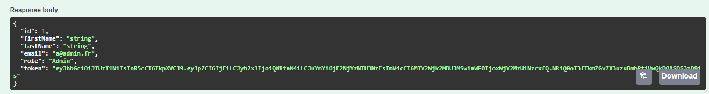

# doItForMeBack
## Etapes pour installation:
### Paramétrer la chaine de connection
Dans MySQL, créez une base de données nommée DoItForMeDatabase. <br>
Au sein du projet, allez dans appsettings.json et personnalisez la phrase de "ConnectionStrings" avec votre propre user et password 

### Effectuer et executer les migrations (Windows)

Ouvrir la console:<br>
outils -> Gestionnaire de package NuGet -> Console du Gestionnaire de package

Créer une migration (si nécessaire)
```shell
add-migration nomDeLaMigration
```

Executez la migration pour créer ou mettre à jour le schéma de la base de données.
```shell
update-database
```

### Effectuer et executer les migrations (Mac)

Gérer les packages NuGet -> Installer Core Entity Framework

Créer une migration (si nécessaire)
```shell
dotnet ef migrations add nomDeLaMigration
```

Executez la migration pour créer ou mettre à jour le schéma de la base de données.
```shell
dotnet ef update database
```

### Démarrer avec Swagger
L'API possède 2 rôles, "User" et "Admin". Le premier donne accès à certaines méthodes et le second à l'ensemble de celles-ci. Si vous n'êtes pas connecté, vous n'aurez accès à aucune d'entre elles. Donc dans un premier temps il faut créer un administrateur et se connecter avec lui.

#### Créer un administrateur
Lancez le projet.<br>
Utilisez la méthode "Registration" située dans la section Security pour créer un admin. 


Cliquez sur "Try it out" et complétez le fichier JSON. Dans rôle, notez bien "Admin" commençant par une majuscule. Ensuite cliquez sur "Execute"

```json
{
  "role": "Admin",
}
```

Si vous souhaitez simplement créer un utilisateur, notez "User".

#### Se connecter
A présent, il faut se connecter avec l'admin nouvellement créé. En suivant le même principe, utilisez la méthode "Login" située dans la section Security et renseignez votre email et votre mot de passe puis cliquez sur "Execute.


En réponse, si vos identifiants sont correctes, vous recevrez un JSON contenant quelques informations sur vous, mais surtout le jeton JWT (Json Web Token). Copiez le ! 



Remontez tout en haut de la page pour trouver le bouton "Authorize", cliquez dessus et dans l'input de la pop up qui est apparu, notez "Bearer" faite un espace et collez votre Token. Confirmez et quittez la pop up.


C'est bon vous êtes prêt à essayer l'API.

Ressources:

- [initialiser EF Core](https://dev.to/renukapatil/create-web-api-with-aspnet-core-60-46l4).
- [Gérer l'authentification avec JWT](https://jasonwatmore.com/post/2021/12/14/net-6-jwt-authentication-tutorial-with-example-api);

- [Commenter son code avec .Net](https://vincentlaine.developpez.com/tuto/dotnet/comdoc/#LIII-B-1).
- [Nommer ses branches et ses commits](https://www.codeheroes.fr/2020/06/29/git-comment-nommer-ses-branches-et-ses-commits/).
